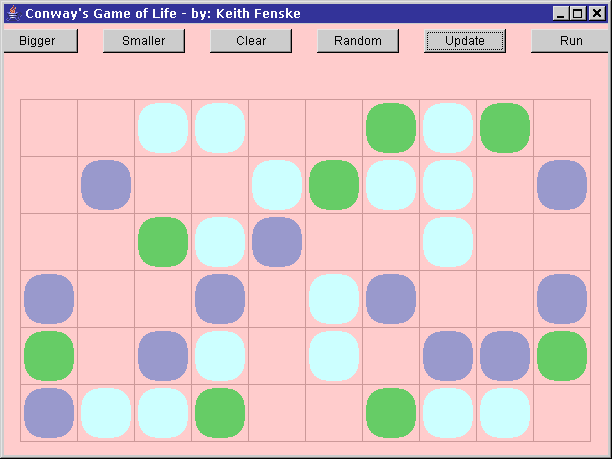

### Life Game (Java)

by: Keith Fenske, https://kwfenske.github.io/

Life is an old Java 1.1 AWT (GUI) applet to play John Conway's Game of Life.
You define a board pattern and then watch as the computer projects future
generations of this pattern based on rules for growth and decay. Even with some
of the most simple initial patterns, you can obtain results that are both
beautiful and intriguing.

Cells (squares) on a rectangular grid are either empty or full (occupied). The
next generation is calculated by counting the number of occupied neighbors, up
to a maximum of eight. Fewer than two neighbors, or more than three, results in
death: the cell will be empty in the next generation. No change is made if
there are exactly two neighbors. Exactly three neighbors results in a birth:
the cell will be occupied.

The program's comments and documentation reference web sites that no longer
exist, and discuss differences in Java versions that are now meaningless. No
changes will be considered. Web page applets are obsolete and may run as
stand-alone applications with the help of a wrapper (included). This becomes
less likely after Java 9 (2017). Rewriting for Java Swing or newer JavaFX is
not an easy job.

Download the ZIP file here: https://kwfenske.github.io/life-game-java.zip

Released under the terms and conditions of the GNU General Public License,
version 3 or later (GPLv3+). Permission is hereby granted to convert this web
page applet to the Apache License (version 2.0 or later) or to GNU GPLv2.

